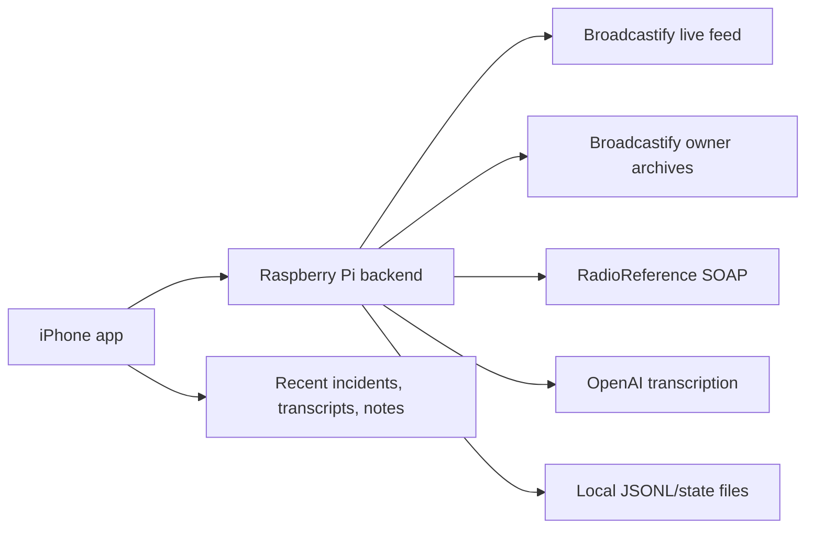

# Phillipsburg Radio

[](https://github.com/FrankTheTank908/PhillipsburgRadio-iOS/actions/workflows/build-ios.yml)
[](https://github.com/FrankTheTank908/PhillipsburgRadio-iOS/actions/workflows/build-pi-backend-image.yml)

Phillipsburg Radio is a private SwiftUI iPhone scanner companion backed by a Raspberry Pi service. The app plays the Phillipsburg / Easton Public Safety Broadcastify feed, shows current feed health and listener stats, and surfaces recent completed-call incident transcripts generated by the Pi.

The iPhone app never stores Broadcastify, RadioReference, or OpenAI credentials. The Raspberry Pi is the only runtime backend.

## Highlights

- Native SwiftUI iPhone app with AVPlayer live audio playback.
- Pi-only backend configured privately at build time.
- Broadcastify domain-key stream resolution kept off-device.
- Completed-call transcription pipeline for recent scanner traffic.
- ffmpeg audio cleanup for recorded/archive chunks before transcription.
- Broadcastify feed-owner archive backfill for missed or past traffic.
- RadioReference SOAP metadata routes for feed/database lookup.
- Incident grouping that merges related transcript fragments into one recent incident.
- Local incident chat and debug tools for personal operations.
- GitHub Actions builds both the unsigned iOS IPA and flashable Raspberry Pi image.

## Current Feed

| Field | Value |
| --- | --- |
| Feed | Phillipsburg / Easton Public Safety |
| Broadcastify feed ID | `45951` |
| Public app backend | Stored in the `PUBLIC_BASE_URL` GitHub secret |
| App config endpoint | Stored in `APP_FEED_CONFIG_URL`, or derived from `PUBLIC_BASE_URL` |
| Public feed page | `https://www.broadcastify.com/listen/feed/45951` |

## Architecture



The Pi listens on internal port `80`. The router exposes it through a private public endpoint stored in GitHub Secrets. The app uses a build-time `FeedConfigURL` value from `Info.plist`, so the real backend host is not committed to the repository.

## App Experience

The first screen is the scanner console, not a landing page.

- **Audio Player** starts and stops the live Broadcastify stream resolved by the Pi.
- **Current Stream Config** shows feed ID, API status, listener count, bitrate, update time, expiration, and backend source.
- **Recent Incidents** shows completed scanner traffic after the Pi records, cleans, transcribes, and groups audio chunks.
- **Incident Chat** stores local notes on the Pi for follow-up and debugging.
- **Settings** exposes playback retry behavior, transcript polling, stream URL debugging, and runtime diagnostics.

Debug/admin tools are intentionally unlocked for this personal build:

```swift
AppConfig.requiresAdminPassword = false
```

Set that flag to `true` before sharing a public Release build.

## Backend Capabilities

| Capability | Endpoint / Service |
| --- | --- |
| Health and runtime status | `GET /health` |
| Current playable stream URL | `GET /current-feed.json` |
| Force stream refresh | `GET /current-feed.json?refresh=1` |
| Metadata and route catalog | `GET /metadata` |
| Completed-call transcripts | `GET /transcripts` |
| Local incident notes | `GET /incidents`, `POST /incidents` |
| Debug logs | `GET /admin/logs` |
| Manual refresh | `POST /admin/refresh` |
| RadioReference methods | `GET /radio-reference/methods` |
| RadioReference ZIP lookup | `GET /radio-reference/zipcode?zipcode=08865` |
| RadioReference user feeds | `GET /radio-reference/user-feeds` |

`GET /transcripts` returns the app-ready incident view:

```json
{
  "events": [],
  "incidents": [],
  "pipeline": {
    "ok": true,
    "state": "transcribed",
    "message": "Added transcript to inc-..."
  }
}
```

## Transcript Pipeline

The transcript system is post-call by design. It does not perform live speech-to-text while the player is running.

The Pi pipeline:

- records short scanner chunks from the resolved feed URL;
- pulls Broadcastify owner archive blocks when archive credentials are available;
- applies ffmpeg cleanup with high-pass, low-pass, noise reduction, and loudness normalization;
- skips mostly silent chunks;
- sends completed audio to OpenAI transcription when `OPENAI_API_KEY` is configured;
- groups related transcript fragments into recent incidents using keyword, unit, timing, and optional AI summary logic.

Archive backfill is useful for older or missed traffic because Broadcastify archives are already broken into historical audio blocks. Live chunk recording is still useful for the newest traffic before archive blocks are available.

## Configuration

Runtime configuration is written into the Pi image by GitHub Actions and copied to the boot partition as `phillipsburg-radio.env`. The app does not need these values.

| Variable | Purpose |
| --- | --- |
| `BROADCASTIFY_API_KEY` | Approved Broadcastify domain key for the private backend |
| `BROADCASTIFY_FEED_ID` | Feed ID, currently `45951` |
| `BROADCASTIFY_USERNAME` / `BROADCASTIFY_PASSWORD` | Optional feed-owner archive backfill credentials |
| `RADIOREFERENCE_API_KEY` | Optional RadioReference SOAP app key |
| `RADIOREFERENCE_USERNAME` / `RADIOREFERENCE_PASSWORD` | Optional RadioReference SOAP account credentials |
| `OPENAI_API_KEY` | Enables completed-call transcription and incident summarization |
| `BACKEND_ADMIN_TOKEN` | Server-side admin token when debug no-auth mode is disabled |
| `ALLOW_DEBUG_ADMIN_WITHOUT_TOKEN` | Personal-build admin bypass, currently `1` |
| `PUBLIC_BASE_URL` | Public app-facing backend base URL, stored only as a GitHub secret |
| `APP_FEED_CONFIG_URL` | Full iOS app config endpoint, stored only as a GitHub secret |
| `BROADCASTIFY_REFERER` | Broadcastify-approved backend referer, stored only as a GitHub secret |
| `BACKEND_PORT` | Pi-local HTTP port, currently `80` |

Transcript tuning is also controlled through env values:

| Variable | Default |
| --- | --- |
| `OPENAI_TRANSCRIBE_MODEL` | `gpt-4o-transcribe` |
| `OPENAI_INCIDENT_MODEL` | `gpt-5.5` |
| `TRANSCRIPT_CHUNK_SECONDS` | `25` |
| `MIN_SPEECH_SECONDS` | `3` |
| `ARCHIVE_LOOKBACK_HOURS` | `12` |
| `ARCHIVE_POLL_SECONDS` | `1200` |
| `AUDIO_CLEANUP_FILTER` | `highpass=f=250,lowpass=f=3600,afftdn=nf=-28,loudnorm=I=-18:TP=-2:LRA=11` |

## Build Outputs

| Workflow | Artifact |
| --- | --- |
| `Build unsigned iOS IPA` | `PhillipsburgRadio-unsigned-ipa` |
| `Build Raspberry Pi backend image` | `phillipsburg-radio-backend-pi-image` |

The Pi workflow customizes the official Raspberry Pi OS Lite 64-bit image directly. It installs the backend, systemd units, runtime config, SSH enablement marker, and transcript pipeline service into the image.

The iOS workflow builds with signing disabled. The produced IPA must be signed before installation on a physical iPhone.

## Repository Layout

```text
.github/workflows/
  build-ios.yml
  build-pi-backend-image.yml

backend/
  broadcastify_api_backend.py
  phillipsburg_radio_server.py
  radioreference_api.py
  transcript_pipeline.py
  systemd/

PhillipsburgRadio/
  AppConfig.swift
  ContentView.swift
  IncidentStore.swift
  RadioPlayer.swift
  SettingsView.swift
  TranscriptStore.swift

PhillipsburgRadio.xcodeproj/
config/
```

## Runtime Data

The Pi stores mutable app data under `/var/lib/phillipsburg-radio`:

| Path | Contents |
| --- | --- |
| `current-feed.json` | Current app stream config |
| `transcripts.jsonl` | Completed-call transcript events |
| `incident-state.json` | Grouped incident summaries |
| `incidents.jsonl` | Local incident chat notes |
| `transcript-pipeline-status.json` | Worker status shown in `/health` and `/transcripts` |
| `archive-state.json` | Processed archive IDs |
| `recordings/` | Raw and cleaned audio chunks |

## Development

Backend validation:

```powershell
python -m py_compile backend\broadcastify_api_backend.py backend\radioreference_api.py backend\phillipsburg_radio_server.py backend\transcript_pipeline.py
python backend\test_broadcastify_api_backend.py
python backend\test_radioreference_api.py
python backend\test_phillipsburg_radio_server.py
python backend\test_transcript_pipeline.py
```

Repository hygiene:

```powershell
git diff --check
```

The iOS build is validated by the GitHub Actions workflow because this repository is typically edited from Windows while Xcode builds run on GitHub-hosted macOS runners.

## Responsible Use

Broadcastify and RadioReference credentials stay on the Pi backend and in GitHub Actions secrets. They should not be committed, placed in the app, pasted into screenshots, or shared through public artifacts.

Broadcastify archive access is limited by Broadcastify's terms. The feed-owner API is intended for providers and feed archive data is for personal use by the owner/provider. Archive availability is not guaranteed, and Broadcastify documents retention as up to 365 days. Review the official Broadcastify support pages before expanding transcript/archive behavior beyond this private build.

## Project Status

This is a personal operational build for the Phillipsburg / Easton feed. The app name and front end remain local-focused, while the backend has a broader core that can support RadioReference metadata, archive backfill, and incident transcript grouping for other authorized feeds later.
